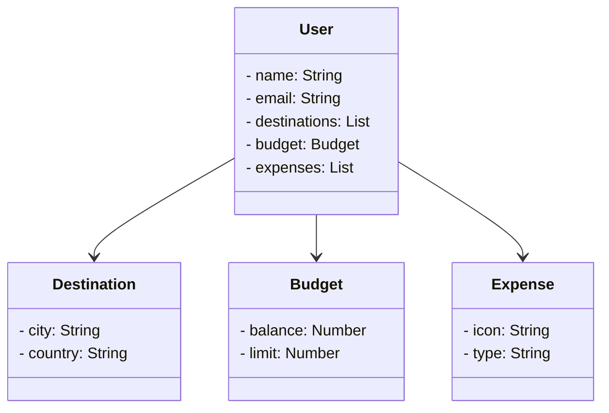

# Java RESTful API
Java RESTful API com Spring Boot 3, Java 17 e Railway baseada no lab da Digital Innovation One.

# Diagrama de Classes (Domínio da API)

# Documentação da API (Swagger)

https://java-api-prd.up.railway.app/swagger-ui/index.html

*<i>Disponível no Railway por um período de tempo limitado.</i>